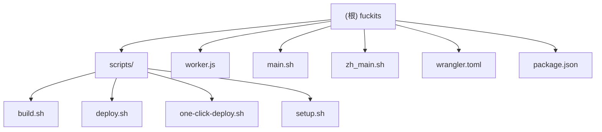

# fuckits 项目文档

## 变更记录 (Changelog)

| 时间 | 操作 | 说明 |
|------|------|------|
| 2025-12-06 | 架构分析更新 | 完成项目架构深度扫描，确认模块结构和覆盖率 |
| 2025-12-05 22:23:10 | 初始化 | 首次生成项目架构文档 |

---

## 项目愿景

fuckits 是一个基于 AI 的智能命令行工具，通过自然语言描述自动生成并执行 Shell 命令。项目部署在 Cloudflare Workers 上，提供中英文双语支持，用户无需提供自己的 OpenAI API Key 即可使用。

**核心价值**：
- 降低命令行使用门槛，让自然语言直接转换为可执行命令
- 提供安全的交互式确认机制
- 支持临时使用和永久安装两种模式
- 完全开源，可自部署

---

## 架构总览

fuckits 采用前后端分离架构：
- **前端**：Bash 安装脚本（main.sh / zh_main.sh），部署在用户本地
- **后端**：Cloudflare Worker（worker.js），处理 AI 请求
- **构建系统**：npm scripts + bash 脚本，自动化构建和部署流程

**技术栈**：
- Runtime: Cloudflare Workers (V8 Isolates)
- AI: OpenAI API (gpt-4-turbo)
- CLI: Bash Shell Script
- Build: Node.js + Bash
- Deploy: Wrangler CLI

---

## 模块结构图



---

## 模块索引

| 模块路径 | 职责 | 语言 | 入口文件 |
|---------|------|------|---------|
| `/` | 项目根目录，包含核心文件 | JavaScript/Bash | worker.js, main.sh, zh_main.sh |
| `/scripts` | 构建和部署脚本集合 | Bash | build.sh, deploy.sh, one-click-deploy.sh, setup.sh |

---

## 运行与开发

### 快速开始（用户侧）

**安装（英文版）**：
```bash
curl -sS https://fuckits.25500552.xyz | bash
```

**安装（中文版）**：
```bash
curl -sS https://fuckits.25500552.xyz/zh | bash
```

**临时使用**：
```bash
curl -sS https://fuckits.25500552.xyz | bash -s "your command prompt"
```

**使用示例**：
```bash
fuck install git
fuck find all files larger than 10MB
fuck uninstall  # 卸载工具本身
fuck config     # 查看配置
```

### 开发者部署

**一键部署**：
```bash
npm run one-click-deploy
```

**手动部署**：
```bash
npm install
npx wrangler login
npx wrangler secret put OPENAI_API_KEY
npm run deploy
```

**本地开发**：
```bash
npm run dev
```

**可用脚本**：
- `npm run build` - 构建 Worker（嵌入脚本）
- `npm run deploy` - 构建并部署
- `npm run one-click-deploy` - 完整自动化部署
- `npm run setup` - 交互式配置向导
- `npm run dev` - 本地开发服务器

---

## 测试策略

### 当前状态
项目暂无自动化测试，依赖手动测试。

### 测试方法
1. **安装脚本测试**：在干净环境中测试安装流程
2. **Worker 测试**：使用 `wrangler dev` 本地测试
3. **端到端测试**：部署后通过 curl 测试完整流程

### 建议改进
- 添加 shell 脚本单元测试（使用 bats 或 shunit2）
- 添加 Worker 单元测试（使用 Vitest）
- 添加集成测试脚本

---

## 编码规范

### Bash 脚本规范
- 使用 `set -euo pipefail` 严格模式
- 函数命名：`_模块名_功能描述`（私有函数加下划线前缀）
- 变量命名：`readonly` 用于常量，`local` 用于局部变量
- 颜色定义：统一使用 ANSI 转义码常量
- 错误处理：重要操作后检查退出码

### JavaScript 规范
- 使用 ES6+ 语法
- 异步操作使用 async/await
- 错误处理：try-catch + 明确的错误响应
- 函数注释：使用 JSDoc 格式

### 通用规范
- 文件编码：UTF-8
- 换行符：LF (Unix)
- 缩进：2 空格（JavaScript）/ 4 空格（Bash）
- 注释：中英文混合，关键逻辑必须注释

---

## AI 使用指引

### 项目特点
- **双语支持**：main.sh（英文）和 zh_main.sh（中文）是两个独立的安装脚本
- **嵌入式架构**：安装脚本通过 base64 编码嵌入到 worker.js 中
- **配置系统**：用户配置存储在 `~/.fuck/config.sh`

### 修改建议
1. **修改安装脚本**：
   - 编辑 `main.sh` 或 `zh_main.sh`
   - 运行 `npm run build` 重新嵌入
   - 运行 `npm run deploy` 部署

2. **修改 Worker 逻辑**：
   - 编辑 `worker.js`
   - 注意不要手动修改 base64 字符串
   - 运行 `npm run deploy` 部署

3. **添加新功能**：
   - 在 `main.sh` 中添加新的命令处理函数
   - 在 `worker.js` 中添加对应的 API 端点（如需要）
   - 更新配置文件模板（如需要）

### 常见任务
- **更新 AI 提示词**：修改 `worker.js` 中的 `system_prompt`
- **添加新命令**：在 `_fuck_execute_prompt` 函数中添加条件分支
- **修改配置项**：更新 `_fuck_ensure_config_exists` 中的配置模板

---

## 核心文件说明

### worker.js
Cloudflare Worker 主文件，处理：
- GET 请求：根据 User-Agent 返回安装脚本或重定向到 GitHub
- GET `/health`：返回 JSON 健康检查（含 hasApiKey）供部署自检
- POST 请求：接收用户提示词，调用 OpenAI API，返回生成的命令

**关键函数**：
- `handleGetRequest()` - 处理脚本下载和浏览器访问
- `handlePostRequest()` - 处理 AI 命令生成请求
- `b64_to_utf8()` - Base64 解码工具函数

### main.sh / zh_main.sh
安装和运行脚本，支持两种模式：
- **安装模式**：无参数运行，安装到 `~/.fuck/`
- **临时模式**：带参数运行，直接执行不安装

**核心函数**：
- `_fuck_execute_prompt()` - 主执行函数，发送请求到 Worker
- `_install_script()` - 安装逻辑
- `_uninstall_script()` - 卸载逻辑
- `_fuck_show_config_help()` - 配置帮助

### wrangler.toml
Cloudflare Workers 配置文件：
- Worker 名称：`fuckits`
- 路由配置：`fuckits.25500552.xyz/*`（英文）+ `/zh` 路径（中文）
- 兼容日期：2025-10-26

### package.json
项目元数据和脚本定义：
- 版本：2.0.0
- 依赖：wrangler ^3.80.0
- 脚本：build, deploy, one-click-deploy, setup, dev

---

## 配置系统

### 用户配置文件
位置：`~/.fuck/config.sh`

**可用配置项**：
```bash
# 自定义 API 端点
export FUCK_API_ENDPOINT="https://your-domain.workers.dev/"

# 额外别名
export FUCK_ALIAS="pls"

# 自动执行模式（跳过确认）
export FUCK_AUTO_EXEC=false

# 请求超时（秒）
export FUCK_TIMEOUT=30

# 调试模式
export FUCK_DEBUG=false

# 禁用默认别名
export FUCK_DISABLE_DEFAULT_ALIAS=false
```

### Worker 环境变量
通过 `wrangler secret put` 设置：
- `OPENAI_API_KEY` - OpenAI API 密钥（必需）
- `OPENAI_API_MODEL` - AI 模型（可选，默认 gpt-4-turbo）
- `OPENAI_API_BASE` - API 基础 URL（可选，默认 OpenAI 官方）
- `SHARED_DAILY_LIMIT` - 共享演示模式每日限额（可选，默认 10）
- `ADMIN_ACCESS_KEY` - 管理员免限额密钥，需与 CLI `FUCK_ADMIN_KEY` 一致
- `QUOTA_KV` - （KV 绑定）可选但推荐，用于跨 PoP 持久化配额计数

---

## 部署流程

### 构建过程
1. `scripts/build.sh` 读取 `main.sh` 和 `zh_main.sh`
2. 使用 base64 编码脚本内容
3. 通过 sed 替换 `worker.js` 中的占位符
4. 验证构建结果

### 部署过程
1. 运行构建脚本
2. `wrangler deploy` 上传到 Cloudflare
3. 配置自定义域名（手动）

### 一键部署流程
`scripts/one-click-deploy.sh` 自动化完成：
1. 环境检查（Node.js, npm, curl）
2. 安装 npm 依赖
3. Cloudflare 认证
4. 配置 OpenAI API Key
5. 构建 Worker
6. 部署到 Cloudflare

---

## 故障排查

### 常见问题

**问题：安装后命令不可用**
- 解决：重启终端或运行 `source ~/.bashrc` / `source ~/.zshrc`

**问题：API 调用失败**
- 检查：Worker 是否正确设置了 `OPENAI_API_KEY`
- 检查：网络连接是否正常
- 检查：API Key 是否有效且有余额

**问题：构建失败**
- 确认：`main.sh` 和 `zh_main.sh` 文件存在
- 确认：文件权限正确
- 确认：sed 命令可用

**问题：部署失败**
- 检查：是否已登录 Cloudflare (`npx wrangler whoami`)
- 检查：`wrangler.toml` 配置是否正确
- 检查：网络连接

---

## 项目统计

- **总文件数**：约 15 个核心文件
- **代码行数**：
  - worker.js: ~150 行
  - main.sh: ~460 行
  - zh_main.sh: ~475 行
  - scripts: ~400 行
- **支持语言**：中文、英文
- **支持平台**：macOS, Linux (apt/yum/dnf/pacman/zypper/brew)
- **支持 Shell**：bash, zsh, sh

---

## 扩展计划

根据 README 中的头脑风暴：
- Amber 语言重构：跨平台 CLI + UI
- 多模型路由：支持 OpenAI、Anthropic、DeepSeek 等
- 命令历史与收藏：`fuck history` 功能
- 场景模板：内置运维、开发、数据等场景
- UI 皮肤：猫娘/御姐/严肃模式
- 团队模式：共享配置和模板

---

## 相关资源

- **GitHub**: https://github.com/Silentely/fuckits
- **官网**: https://fuckits.25500552.xyz
- **中文站**: https://fuckits.25500552.xyz/zh
- **许可证**: MIT
- **作者**: faithleysath
