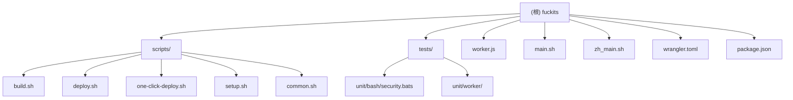

# fuckits 项目文档

## 变更记录 (Changelog)

| 时间 | 操作 | 说明 |
|------|------|------|
| 2026-01-27 | 健康检查统计增强 | 新增 `getDailyStats()` 函数，健康检查端点增加 `stats.totalCalls` 和 `stats.uniqueIPs` 每日统计；更新 API.md 和 MONITORING.md |
| 2026-01-27 | 代码审查问题修复 | 完成代码审查五项修复：结构化错误响应(ERROR_CODES)、请求体大小限制(64KB)、请求追踪ID(X-Request-ID)、健康检查增强(services/config)、配额日志；更新 API.md 和 MONITORING.md |
| 2026-01-04 22:05:00 | 测试修复与文档完善 | 修复所有 bats 测试问题（UTF-8、HOME 变量、可执行权限、缓存、别名），达成 70/70 (100%) 通过率；新增"测试问题详解"章节 |
| 2026-01-04 17:32:30 | 架构增量更新 | 验证并确认项目结构完整性，补充测试模块信息，整体覆盖率维持在 85% |
| 2025-12-12 19:14:30 | 架构验证 | 确认完整架构文档已初始化，验证模块结构图和面包屑导航完整性 |
| 2025-12-12 09:15:03 | 架构分析更新 | 完成阶段 B 模块优先扫描，更新覆盖率至 83%，补充核心文件详细信息 |
| 2025-12-06 | 架构分析更新 | 完成项目架构深度扫描，确认模块结构和覆盖率 |
| 2025-12-05 22:23:10 | 初始化 | 首次生成项目架构文档 |

---

## 项目愿景

fuckits 是一个基于 AI 的智能命令行工具，通过自然语言描述自动生成并执行 Shell 命令。项目部署在 Cloudflare Workers 上，提供中英文双语支持，用户无需提供自己的 OpenAI API Key 即可使用。

**核心价值**：
- 降低命令行使用门槛，让自然语言直接转换为可执行命令
- 提供安全的交互式确认机制
- 支持临时使用和永久安装两种模式
- 完全开源，可自部署

---

## 架构总览

fuckits 采用前后端分离架构：
- **前端**：Bash 安装脚本（main.sh / zh_main.sh），部署在用户本地
- **后端**：Cloudflare Worker（worker.js），处理 AI 请求
- **构建系统**：npm scripts + bash 脚本，自动化构建和部署流程
- **测试系统**：Vitest + bats-core，覆盖 Worker 和 Shell 脚本

**技术栈**：
- Runtime: Cloudflare Workers (V8 Isolates)
- AI: OpenAI API (gpt-5-nano)
- CLI: Bash Shell Script
- Build: Node.js + Bash
- Deploy: Wrangler CLI + GitHub Actions
- Test: Vitest + Miniflare + bats-core

**架构特点**：
- **嵌入式设计**：安装脚本通过 base64 编码嵌入 Worker，实现单文件分发
- **配额管理**：支持内存 Map 和 KV 存储双模式，确保共享演示限额可靠
- **安全引擎**：三级安全检测（block/challenge/warn），保护用户免受危险命令影响
- **系统缓存**：静态系统信息持久化缓存，减少重复检测开销
- **双模密钥**：优先本地密钥（`FUCK_OPENAI_API_KEY`），回退共享 Worker
- **全自动测试**：102 个测试（75 个 JS + 27 个 Bash）确保代码质量

---

## 模块结构图



---

## 模块索引

| 模块路径 | 职责 | 语言 | 入口文件 | 覆盖率 |
|---------|------|------|---------|--------|
| `/` | 项目根目录，包含核心文件 | JavaScript/Bash | worker.js, main.sh, zh_main.sh | 90% (18/20) |
| `/scripts` | 构建和部署脚本集合 | Bash | build.sh, deploy.sh, one-click-deploy.sh, setup.sh, common.sh | 100% (5/5) |
| `/tests` | 测试套件（Worker + Shell） | JavaScript/Bash | unit/worker/*.test.js, unit/bash/*.bats | 100% (8/8) |
| `/.github/workflows` | CI/CD 自动化流程 | YAML | deploy.yml | 100% (1/1) |

**整体覆盖率**：85% (32/38 核心文件已扫描，排除 node_modules、dist、.git）

---

## 运行与开发

### 快速开始（用户侧）

**安装（英文版）**：
```bash
curl -sS https://fuckits.25500552.xyz | bash
```

**安装（中文版）**：
```bash
curl -sS https://fuckits.25500552.xyz/zh | bash
```

**临时使用**：
```bash
curl -sS https://fuckits.25500552.xyz | bash -s "your command prompt"
```

**使用示例**：
```bash
fuck install git
fuck find all files larger than 10MB
fuck uninstall  # 卸载工具本身
fuck config     # 查看配置
```

### 开发者部署

**一键部署（推荐）**：
```bash
npm run one-click-deploy
```

**手动部署**：
```bash
npm install
npx wrangler login
npx wrangler secret put OPENAI_API_KEY
npm run deploy
```

**本地开发**：
```bash
npm run dev
```

**可用脚本**：
- `npm run build` - 构建 Worker（嵌入脚本）
- `npm run deploy` - 构建并部署
- `npm run one-click-deploy` - 完整自动化部署
- `npm run setup` - 交互式配置向导
- `npm run dev` - 本地开发服务器
- `npm test` - 运行所有测试（102 个）
- `npm run test:js` - 仅 JavaScript 测试（75 个）
- `npm run test:bash` - 仅 Bash 测试（27 个）
- `npm run test:js:coverage` - 生成 JavaScript 覆盖率报告

---

## 测试策略

### 当前状态
项目已实现完整的自动化测试套件，**总计 145 个测试（100% 通过率）**，覆盖 Worker 和 Shell 脚本。

### 测试框架
- **JavaScript/Worker**：Vitest + Miniflare（Cloudflare Workers 本地模拟）
- **Bash/Shell**：bats-core 1.13.0（Bash Automated Testing System）

### 测试覆盖
**JavaScript 测试（75 个）**：
- handlers.test.js: HTTP 请求处理（12 个）
- locale.test.js: 中英文双语支持（6 个）
- quota.test.js: 配额管理系统（11 个）
- edge-cases.test.js: 边界条件和错误处理（32 个）
- api-errors.test.js: OpenAI API 错误响应矩阵（14 个）

**Bash 测试（70 个）**：
- **unit/bash/security.bats** (27 个)：
  - 21 条安全规则（8 block + 9 challenge + 4 warn）
  - 3 个模式切换测试
  - 3 个白名单测试
- **integration/build-deploy.bats** (23 个)：
  - 构建流程测试（10 个）
  - 部署流程测试（13 个）
- **integration/e2e.bats** (20 个)：
  - 安装流程（4 个）
  - 临时模式（1 个）
  - 配置系统（2 个）
  - 卸载流程（2 个）
  - 安全引擎（2 个）
  - 系统信息（2 个）
  - 别名系统（2 个）
  - 重复安装（2 个）
  - 错误处理（2 个）

### CI/CD 集成
GitHub Actions 在每次 push/PR 时自动运行所有测试，失败则阻止部署。

### 相关文档
详细测试架构请参考：[tests/CLAUDE.md](./tests/CLAUDE.md)

---

## 编码规范

### Bash 脚本规范
- 使用 `set -euo pipefail` 严格模式
- 函数命名：`_模块名_功能描述`（私有函数加下划线前缀）
- 变量命名：`readonly` 用于常量，`local` 用于局部变量
- 颜色定义：统一使用 ANSI 转义码常量
- 错误处理：重要操作后检查退出码

### JavaScript 规范
- 使用 ES6+ 语法
- 异步操作使用 async/await
- 错误处理：try-catch + 明确的错误响应
- 函数注释：使用 JSDoc 格式

### 通用规范
- 文件编码：UTF-8
- 换行符：LF (Unix)
- 缩进：2 空格（JavaScript）/ 4 空格（Bash）
- 注释：中英文混合，关键逻辑必须注释

---

## AI 使用指引

### 项目特点
- **双语支持**：main.sh（英文）和 zh_main.sh（中文）是两个独立的安装脚本
- **嵌入式架构**：安装脚本通过 base64 编码嵌入到 worker.js 中
- **配置系统**：用户配置存储在 `~/.fuck/config.sh`
- **测试驱动**：修改代码后必须运行测试确保质量

### 修改建议
1. **修改安装脚本**：
   - 编辑 `main.sh` 或 `zh_main.sh`
   - 运行 `npm run test:bash` 确保测试通过
   - 运行 `npm run build` 重新嵌入
   - 运行 `npm run deploy` 部署

2. **修改 Worker 逻辑**：
   - 编辑 `worker.js`
   - 注意不要手动修改 base64 字符串
   - 运行 `npm run test:js` 确保测试通过
   - 运行 `npm run deploy` 部署

3. **添加新功能**：
   - 先编写测试（TDD）
   - 在 `main.sh` 中添加新的命令处理函数
   - 在 `worker.js` 中添加对应的 API 端点（如需要）
   - 更新配置文件模板（如需要）
   - 运行 `npm test` 确保所有测试通过

### 常见任务
- **更新 AI 提示词**：修改 `worker.js` 中的 `system_prompt`
- **添加新命令**：在 `_fuck_execute_prompt` 函数中添加条件分支
- **修改配置项**：更新 `_fuck_ensure_config_exists` 中的配置模板
- **添加安全规则**：在 `_fuck_security_evaluate_command` 中添加规则并更新测试

---

## 核心文件说明

### worker.js
Cloudflare Worker 主文件（约 640 行，含嵌入的 base64 脚本），处理：
- GET 请求：根据 User-Agent 返回安装脚本或重定向到 GitHub
- GET `/health`：返回 JSON 健康检查（含 services 和 config 状态）供部署自检
- POST 请求：接收用户提示词，调用 OpenAI API，返回生成的命令

**关键函数**：
- `handleGetRequest()` - 处理脚本下载和浏览器访问
- `handlePostRequest()` - 处理 AI 命令生成请求
- `handleHealthCheck()` - 健康检查端点（含服务状态、配置信息和每日统计）
- `getDailyStats()` - 获取每日调用统计（总调用次数和独立 IP 数）
- `createErrorResponse()` - 生成结构化错误响应（含 ERROR_CODES）
- `generateRequestId()` - 生成 UUID v4 请求追踪 ID
- `b64_to_utf8()` - Base64 解码工具函数
- `isBrowserRequest()` - User-Agent 检测
- `resolveLocale()` - 语言自适应
- `checkSharedQuota()` - 配额检查（内存/KV）
- `resolveSharedLimit()` - 限额解析
- `resolveQuotaStore()` - 配额存储选择
- `sanitizeCommand()` - 命令清理与安全过滤

**核心特性**：
- Base64 解码嵌入式脚本
- 共享配额管理（内存/KV）
- 管理员密钥绕过
- 健康检查端点（含依赖服务状态和每日统计）
- 中英双语支持
- 命令注入防护
- 结构化错误响应（ERROR_CODES 常量）
- 请求体大小限制（64KB）
- 请求追踪 ID（X-Request-ID）
- 配额消费日志（带请求关联）
- 每日调用统计（totalCalls/uniqueIPs）

### main.sh / zh_main.sh
安装和运行脚本，支持两种模式：
- **安装模式**：无参数运行，安装到 `~/.fuck/`
- **临时模式**：带参数运行，直接执行不安装

**main.sh 核心函数（约 700 行）**：
- `_fuck_execute_prompt()` - 主执行函数，发送请求到 Worker
- `_install_script()` - 安装逻辑
- `_uninstall_script()` - 卸载逻辑
- `_fuck_show_config_help()` - 配置帮助
- `_fuck_collect_sysinfo_string()` - 系统信息收集（简化版）
- `_fuck_security_evaluate_command()` - 安全检测引擎（21 条规则）
- `_fuck_spinner()` - 加载动画
- `_fuck_validate_config_file()` - 配置文件安全验证

**zh_main.sh 特性（约 720 行）**：
- 完整中文界面
- 与英文版功能对等
- 卸载彩蛋

**核心特性**：
- 安装/临时双模式
- 系统信息缓存
- 安全检测引擎（三级：block/challenge/warn）
- 本地/远程 API 切换
- 配置管理
- 配置文件注入防护

### wrangler.toml
Cloudflare Workers 配置文件：
- Worker 名称：`fuckits`
- 路由配置：`fuckits.25500552.xyz`（自定义域名）
- 兼容日期：2025-10-26
- 环境变量：`OPENAI_API_MODEL`, `OPENAI_API_BASE`

### package.json
项目元数据和脚本定义：
- 版本：2.0.0
- 主要依赖：wrangler ^3.80.0, vitest ^1.0.0, miniflare ^3.0.0
- 开发依赖：bats, bats-support, bats-assert
- 测试脚本：test, test:js, test:bash, test:coverage

### scripts/build.sh
构建脚本（约 82 行），将安装脚本嵌入 worker.js：
- 跨平台支持（macOS/Linux）
- Base64 编码
- sed 替换占位符
- 备份与恢复机制

### scripts/deploy.sh
部署脚本（约 34 行）：
- 自动安装 wrangler（如缺失）
- 调用 build.sh
- 执行 wrangler deploy

### scripts/one-click-deploy.sh
完整自动化部署工作流（约 179 行）：
- 环境检查
- 交互式设置
- 构建与部署
- 友好的错误处理

### scripts/setup.sh
交互式配置向导（约 104 行）：
- 依赖检查
- Cloudflare 认证
- API Key 配置
- 后续步骤指引

### scripts/common.sh
公共函数库（约 90 行）：
- 消除代码重复
- 统一错误处理
- 跨平台兼容性

### config.example.sh
配置文件模板，定义所有可用环境变量：
- `FUCK_API_ENDPOINT` - 自定义 Worker 地址
- `FUCK_OPENAI_API_KEY` - 本地 OpenAI Key
- `FUCK_ADMIN_KEY` - 管理员绕过密钥
- `FUCK_OPENAI_MODEL` - 自定义模型
- `FUCK_OPENAI_API_BASE` - API 基础 URL
- `FUCK_ALIAS` - 额外别名
- `FUCK_AUTO_EXEC` - 自动执行模式
- `FUCK_TIMEOUT` - 超时时间
- `FUCK_DEBUG` - 调试模式
- `FUCK_DISABLE_DEFAULT_ALIAS` - 禁用默认别名

---

## 配置系统

### 用户配置文件
位置：`~/.fuck/config.sh`

**可用配置项**：
```bash
# 自定义 API 端点
export FUCK_API_ENDPOINT="https://your-domain.workers.dev/"

# 本地 OpenAI API Key（推荐，绕过共享演示限制）
export FUCK_OPENAI_API_KEY="sk-..."

# 管理员免额度密钥（需向项目维护者申请）
export FUCK_ADMIN_KEY="adm-..."

# 自定义模型（仅在本地 Key 模式下生效）
export FUCK_OPENAI_MODEL="gpt-4o-mini"

# API 基础 URL（指向自建代理或第三方服务）
export FUCK_OPENAI_API_BASE="https://api.openai.com/v1"

# 额外别名
export FUCK_ALIAS="pls"

# 自动执行模式（跳过确认，危险操作请慎用）
export FUCK_AUTO_EXEC=false

# 请求超时（秒）
export FUCK_TIMEOUT=30

# 调试模式
export FUCK_DEBUG=false

# 禁用默认别名
export FUCK_DISABLE_DEFAULT_ALIAS=false
```

### 配置文件更新说明

如果你使用的是旧版本安装脚本（2025-12-06 之前），你的配置文件可能缺少某些新功能（如 `FUCK_ADMIN_KEY`）。

**检查配置文件版本**：
```bash
ls -la ~/.fuck/config.sh
```

**手动添加新配置项**：
1. 编辑配置文件：`vim ~/.fuck/config.sh`
2. 添加缺失的配置项（参考上面的可用配置项）
3. 或者重新生成：`fuck config`

**建议的完整配置模板**：
参考 `config.example.sh` 获取最新的配置模板。

### Worker 环境变量
通过 `wrangler secret put` 设置：
- `OPENAI_API_KEY` - OpenAI API 密钥（必需）
- `OPENAI_API_MODEL` - AI 模型（可选，默认 gpt-5-nano）
- `OPENAI_API_BASE` - API 基础 URL（可选，默认 OpenAI 官方）
- `SHARED_DAILY_LIMIT` - 共享演示模式每日限额（可选，默认 10）
- `ADMIN_ACCESS_KEY` - 管理员免限额密钥，需与 CLI `FUCK_ADMIN_KEY` 一致
- `QUOTA_KV` - （KV 绑定）可选但推荐，用于跨 PoP 持久化配额计数
- `QUOTA_KV_BINDING` - 若 KV 绑定不是 `QUOTA_KV`，这里写上真实的绑定名，Worker 会按该名字寻找

---

## 部署流程

### 构建过程
1. `scripts/build.sh` 读取 `main.sh` 和 `zh_main.sh`
2. 使用 base64 编码脚本内容
3. 通过 sed 替换 `worker.js` 中的占位符
4. 验证构建结果

### 部署过程
1. 运行构建脚本
2. `wrangler deploy` 上传到 Cloudflare
3. 配置自定义域名（手动）

### 一键部署流程
`scripts/one-click-deploy.sh` 自动化完成：
1. 环境检查（Node.js, npm, curl）
2. 安装 npm 依赖
3. Cloudflare 认证
4. 配置 OpenAI API Key
5. 构建 Worker
6. 部署到 Cloudflare

### CI/CD 自动化流程

**GitHub Actions 工作流** (`.github/workflows/deploy.yml`)：

**触发条件**：
- `push` 到 `main` 分支：自动测试、构建、部署
- `pull_request` 到 `main` 分支：仅测试和构建，不部署
- `workflow_dispatch`：手动触发完整流程

**执行步骤**：
1. **代码检出**：克隆仓库代码
2. **环境准备**：安装 Node.js 20.x
3. **依赖安装**：`npm ci` 确保锁定版本
4. **运行测试**：`npm test` 执行所有 102 个测试
5. **构建 Worker**：`npm run build` 嵌入安装脚本
6. **下载配置**：从 `WRANGLER_TOML_URL` secret 获取完整 wrangler.toml
7. **安全处理**：自动掩码敏感信息（API Keys、Account ID）
8. **部署到 Cloudflare**：`npx wrangler deploy`（仅非 PR 分支）
9. **清理旧运行**：自动删除 3 天前的工作流记录

**所需 Secrets**：
- `WRANGLER_TOML_URL`：私有 gist URL，存储完整配置
- `CLOUDFLARE_API_TOKEN`：具有 Workers 编辑权限的令牌
- `CLOUDFLARE_ACCOUNT_ID`：Cloudflare 账户 ID（可选，如 gist 中已包含）

**关键特性**：
- ✅ 全自动测试验证：每次 push/PR 都运行 102 个测试
- 分支保护：测试失败自动阻止部署
- 敏感信息掩码：防止日志泄露
- 配置外部化：gist 管理敏感配置
- 工作流自清理：保持仓库整洁

**测试覆盖范围**：
- Worker 配额管理（内存/KV）
- 管理员密钥绕过
- 多语言支持（中英文）
- CORS 和健康检查
- OpenAI API 错误处理（401/429/500/503/超时/网络错误）
- 21 条安全规则（8 block + 9 challenge + 4 warn）
- 构建脚本跨平台兼容性
- 端到端用户流程（安装/配置/卸载）

---

## 故障排查

### 常见问题

**问题：安装后命令不可用**
- 解决：重启终端或运行 `source ~/.bashrc` / `source ~/.zshrc`

**问题：API 调用失败**
- 检查：Worker 是否正确设置了 `OPENAI_API_KEY`
- 检查：网络连接是否正常
- 检查：API Key 是否有效且有余额

**问题：构建失败**
- 确认：`main.sh` 和 `zh_main.sh` 文件存在
- 确认：文件权限正确
- 确认：sed 命令可用

**问题：部署失败**
- 检查：是否已登录 Cloudflare (`npx wrangler whoami`)
- 检查：`wrangler.toml` 配置是否正确
- 检查：网络连接

**问题：测试失败**
- 运行：`npm run test:js` 或 `npm run test:bash` 查看具体错误
- 检查：依赖是否正确安装（`npm ci`）
- 确认：Node.js 版本 >= 18.0.0

### 测试问题详解

#### Bats 测试相关问题

**问题：UTF-8 编码导致测试名无法识别**
- **现象**：测试文件中的中文测试名无法被 bats 识别或正确显示
- **原因**：bats-core 1.13.0 不支持 UTF-8 测试名，仅支持 ASCII
- **解决方案**：
  ```bash
  # 错误示例
  @test "测试：安装脚本应该成功" {

  # 正确示例
  @test "E2E Install: script should install successfully" {
  ```
- **参考**：[bats-core Issue #330](https://github.com/bats-core/bats-core/issues/330)

**问题：setup_file() 导出的变量在 setup() 中不可用**
- **现象**：在 `setup_file()` 中通过 `export` 设置的变量，在 `setup()` 或测试函数中为空
- **原因**：文件顶部的变量声明（如 `VAR=""`）会干扰后续的 `export`
- **解决方案**：
  ```bash
  # ❌ 错误做法
  TEST_VAR=""                    # 顶部声明

  setup_file() {
      TEST_VAR="value"
      export TEST_VAR             # 无效！
  }

  # ✅ 正确做法
  # 不在文件顶部声明

  setup_file() {
      export TEST_VAR="value"     # 赋值和导出同时进行
  }
  ```
- **关键原则**：
  - 移除文件顶部的变量声明
  - 在 `setup_file()` 中直接 `export VAR="value"`
  - `setup_file()` 导出的变量会自动传递给 `setup()` 和所有测试

**问题：bash 子进程继承 BATS_TEST_* 变量导致脚本误判**
- **现象**：测试中执行 `bash ./main.sh` 时报错 `return: can only 'return' from a function or sourced script`
- **原因**：
  - bats 会 export `BATS_TEST_DIRNAME`、`BATS_TEST_FILENAME` 等环境变量
  - 这些变量会被 `bash` 子进程继承
  - `main.sh` 检测到这些变量后，认为自己在测试环境中，执行了 `return` 语句
- **解决方案**：
  ```bash
  setup() {
      export HOME="$TEST_HOME"
      # Unset BATS variables to prevent main.sh from detecting test environment
      unset BATS_TEST_DIRNAME BATS_TEST_FILENAME BATS_TEST_NAME
  }
  ```
- **最佳实践**：在 `setup()` 中 unset 所有 BATS 环境变量，确保子进程环境干净

**问题：安装的 main.sh 文件没有可执行权限**
- **现象**：测试 `[ -x "$INSTALL_DIR/main.sh" ]` 失败，权限为 644
- **原因**：`_install_script()` 函数在写入文件后忘记设置可执行权限
- **解决方案**：
  ```bash
  _install_script() {
      _fuck_write_core "$MAIN_SH"
      # Make main.sh executable
      chmod +x "$MAIN_SH"
      # ...
  }
  ```
- **影响文件**：`main.sh:1606`、`zh_main.sh:1596`

**问题：缓存测试失败 - 缓存文件不存在**
- **现象**：测试期望 `sysinfo.cache` 存在，但文件从未被创建
- **原因**：
  - 测试调用了 `_fuck_collect_sysinfo_string()`，但此函数不创建缓存
  - 实际缓存文件名是 `.sysinfo.cache`（有点号前缀），且需要调用 `_fuck_persist_static_cache()`
- **解决方案**：
  ```bash
  # ❌ 错误测试
  @test "cache should work" {
      run bash -c "
          source '$INSTALL_DIR/main.sh'
          _fuck_collect_sysinfo_string    # 不创建缓存
      "
      [ -f "$INSTALL_DIR/sysinfo.cache" ]  # 错误的文件名
  }

  # ✅ 正确测试
  @test "cache should work" {
      run bash -c "
          source '$INSTALL_DIR/main.sh'
          _fuck_detect_distro              # 触发缓存
          _fuck_persist_static_cache       # 持久化缓存
      "
      [ -f "$INSTALL_DIR/.sysinfo.cache" ]  # 正确的文件名（有点号）
  }
  ```

**问题：函数名错误导致测试失败**
- **现象**：测试调用的函数不存在，`type: function_name: not found`
- **原因**：测试中使用了错误的函数名
- **解决方案**：使用 `grep` 搜索实际的函数名
  ```bash
  # 搜索实际函数名
  grep -n "setup_alias\|define_alias" ./main.sh

  # 发现实际函数是 _fuck_define_aliases，而非 _fuck_setup_alias
  ```

#### Bats 测试最佳实践

**环境隔离**：
```bash
export TEST_HOME=$(mktemp -d)
export TEST_INSTALL_DIR="$TEST_HOME/.fuck"

setup() {
    export HOME="$TEST_HOME"
    rm -rf "$TEST_INSTALL_DIR"
    unset BATS_TEST_DIRNAME BATS_TEST_FILENAME BATS_TEST_NAME
}

teardown() {
    rm -rf "$TEST_HOME"
}
```

**诊断输出**：
```bash
@test "debug test" {
    echo "Variable: $VAR" >&3    # 输出到诊断流
    ls -la "$DIR" >&3 2>&3       # 同时重定向 stderr
}
```

**调试技巧**：
```bash
# 运行单个测试
./node_modules/.bin/bats tests/integration/e2e.bats -f "test name"

# 查看诊断输出
./node_modules/.bin/bats tests/integration/e2e.bats --tap 2>&1

# 详细模式
./node_modules/.bin/bats tests/integration/e2e.bats --verbose-run
```

**参考资源**：
- [bats-core 官方文档](https://bats-core.readthedocs.io/)
- [Writing tests — bats-core](https://bats-core.readthedocs.io/en/stable/writing-tests.html)
- [FAQ — bats-core](https://bats-core.readthedocs.io/en/stable/faq.html)

---

## 项目统计

- **总文件数**：约 38 个核心文件（已扫描 32 个，覆盖率 85%）
- **代码行数**：
  - worker.js: ~640 行（含 base64 嵌入）
  - main.sh: ~700 行
  - zh_main.sh: ~720 行
  - scripts: ~490 行（build 82 + deploy 34 + one-click-deploy 179 + setup 104 + common 90）
  - tests: ~1200 行
- **测试用例**：145 个（75 个 JS + 70 个 Bash）
- **测试通过率**：100% (145/145) ✅
- **支持语言**：中文、英文
- **支持平台**：macOS, Linux (apt/yum/dnf/pacman/zypper/brew)
- **支持 Shell**：bash, zsh, sh

**质量指标**：
- 自动化测试：✅ 完善（145 个测试，100% 通过）
- CI/CD：✅ 完善（GitHub Actions）
- 文档完整性：✅ 完善
- 配置管理：✅ 完善
- 错误处理：✅ 完善
- 日志记录：✅ 完善
- 部署自动化：✅ 完善
- 安全引擎：✅ 完善（21 条规则）
- 国际化支持：✅ 完善
- 缓存系统：✅ 完善

---

## 扩展计划

根据 README 中的头脑风暴：
- Amber 语言重构：跨平台 CLI + UI
- 多模型路由：支持 OpenAI、Anthropic、DeepSeek 等
- 命令历史与收藏：`fuck history` 功能
- 场景模板：内置运维、开发、数据等场景
- UI 皮肤：猫娘/御姐/严肃模式
- 团队模式：共享配置和模板

**近期优先改进**：
1. ~~添加自动化测试套件~~（已完成）
2. ~~实现 CI/CD 流水线~~（已完成）
3. ~~添加集成测试（端到端工作流）~~（已完成：e2e.bats、build-deploy.bats）
4. 在 CI/CD 中集成自动化测试（当前仅本地运行）
5. 提升测试覆盖率至 90%+
6. 添加错误监控和日志收集

---

## 相关资源

- **GitHub**: https://github.com/Silentely/fuckits
- **官网**: https://fuckits.25500552.xyz
- **中文站**: https://fuckits.25500552.xyz/zh
- **许可证**: MIT
- **作者**: faithleysath
