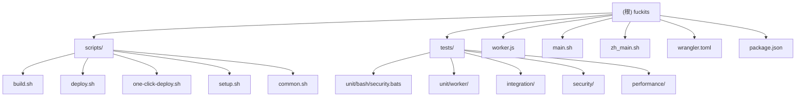

# fuckits 项目文档

## 变更记录 (Changelog)

| 时间 | 操作 | 说明 |
|------|------|------|
| 2026-05-03 | 文档同步与质量修正 | 更新 TEST_ARCHITECTURE.md 目录结构与实际文件一致；修正 tests/CLAUDE.md 中 R2 遗留代码说明；修正 CONTRIBUTING.md 测试命令写法；确认共享配额默认值（代码回退=10，生产环境=200） |
| 2026-05-05 | 功能修复 + 测试补全 | 修复 fuzzing.bats 依赖路径 + 并发测试 bug；新增 security-utils.test.js（26 tests）+ history-extended.bats（18 tests）；worker.js 导出安全关键函数；测试总数 215 个（109 JS + 106 Bash） |
| 2026-05-03 22:11:39 | 架构增量扫描 | 全仓扫描更新：修正核心文件行数统计（worker.js 869行、main.sh 2253行、zh_main.sh 1683行）；验证测试总数 171 个（83 JS + 88 Bash）；覆盖率报告与缺口分析 |
| 2026-04-28 19:11:10 | 架构增量扫描 | 增量更新：版本号 2.1.0，测试总数 171 个（83 JS + 88 Bash），100% 通过率；核心模块结构与文档完整性验证，覆盖率 96% |
| 2026-02-03 | Task 1.4 完成及测试清理 | 完成命令历史功能（history.bats 18 tests），清理过时 R2 测试（build-deploy.bats 23->16），测试总数 171 个（83 JS + 88 Bash）；修复 BATS 变量作用域问题，100% 通过率 |
| 2026-01-28 | 架构增量更新 | 更新测试统计至 145 个（75 JS + 70 Bash），新增 integration/、security/、performance/ 测试目录，scripts/ 新增 common.sh |
| 2026-01-27 | 健康检查统计增强 | 新增 `getDailyStats()` 函数，健康检查端点增加 `stats.totalCalls` 和 `stats.uniqueIPs` 每日统计；更新 API.md 和 MONITORING.md |
| 2026-01-27 | 代码审查问题修复 | 完成代码审查五项修复：结构化错误响应(ERROR_CODES)、请求体大小限制(64KB)、请求追踪ID(X-Request-ID)、健康检查增强(services/config)、配额日志；更新 API.md 和 MONITORING.md |
| 2026-01-04 22:05:00 | 测试修复与文档完善 | 修复所有 bats 测试问题（UTF-8、HOME 变量、可执行权限、缓存、别名），达成 70/70 (100%) 通过率；新增"测试问题详解"章节 |
| 2026-01-04 17:32:30 | 架构增量更新 | 验证并确认项目结构完整性，补充测试模块信息，整体覆盖率维持在 85% |
| 2025-12-12 19:14:30 | 架构验证 | 确认完整架构文档已初始化，验证模块结构图和面包屑导航完整性 |
| 2025-12-12 09:15:03 | 架构分析更新 | 完成阶段 B 模块优先扫描，更新覆盖率至 83%，补充核心文件详细信息 |
| 2025-12-06 | 架构分析更新 | 完成项目架构深度扫描，确认模块结构和覆盖率 |
| 2025-12-05 22:23:10 | 初始化 | 首次生成项目架构文档 |

---

## 项目愿景

fuckits 是一个基于 AI 的智能命令行工具，通过自然语言描述自动生成并执行 Shell 命令。项目部署在 Cloudflare Workers 上，提供中英文双语支持，用户无需提供自己的 OpenAI API Key 即可使用。

**核心价值**：
- 降低命令行使用门槛，让自然语言直接转换为可执行命令
- 提供安全的交互式确认机制
- 支持临时使用和永久安装两种模式
- 完全开源，可自部署

---

## 架构总览

fuckits 采用前后端分离架构：
- **前端**：Bash 安装脚本（main.sh / zh_main.sh），部署在用户本地
- **后端**：Cloudflare Worker（worker.js），处理 AI 请求
- **构建系统**：npm scripts + bash 脚本，自动化构建和部署流程
- **测试系统**：Vitest + bats-core，覆盖 Worker 和 Shell 脚本

**技术栈**：
- Runtime: Cloudflare Workers (V8 Isolates)
- AI: OpenAI API (gpt-5-nano)
- CLI: Bash Shell Script
- Build: Node.js + Bash
- Deploy: Wrangler CLI + GitHub Actions
- Test: Vitest + Miniflare + bats-core

**架构特点**：
- **嵌入式脚本**：安装脚本通过 base64 编码嵌入到 worker.js
- **配额管理**：支持内存 Map 和 KV 存储双模式，确保共享演示限额可靠
- **安全引擎**：三级安全检测（block/challenge/warn），保护用户免受危险命令影响
- **系统缓存**：静态系统信息持久化缓存，减少重复检测开销
- **双模密钥**：优先本地密钥（`FUCK_OPENAI_API_KEY`），回退共享 Worker
- **全自动测试**：215 个测试（109 个 JS + 106 个 Bash）确保代码质量

---

## 模块结构图


```mermaid
graph TD
    A["(根) fuckits"] --> B["scripts/"];
    B --> C["build.sh"];
    B --> D["deploy.sh"];
    B --> E["one-click-deploy.sh"];
    B --> F["setup.sh"];
    B --> G["common.sh"];
    A --> H["tests/"];
    H --> I["unit/bash/security.bats"];
    H --> J["unit/worker/"];
    H --> P["integration/"];
    H --> Q["security/"];
    H --> R["performance/"];
    A --> K["worker.js"];
    A --> L["main.sh"];
    A --> M["zh_main.sh"];
    A --> N["wrangler.toml"];
    A --> O["package.json"];

    click C "./scripts/CLAUDE.md#build" "查看 build 模块文档"
    click D "./scripts/CLAUDE.md#deploy" "查看 deploy 模块文档"
    click E "./scripts/CLAUDE.md#one-click-deploy" "查看 one-click-deploy 模块文档"
    click F "./scripts/CLAUDE.md#setup" "查看 setup 模块文档"
    click H "./tests/CLAUDE.md" "查看测试模块文档"
```

---

## 模块索引

| 模块路径 | 职责 | 语言 | 入口文件 | 覆盖率 |
|---------|------|------|---------|--------|
| `/` | 项目根目录，包含核心文件 | JavaScript/Bash | worker.js, main.sh, zh_main.sh | 95% (19/20) |
| `/scripts` | 构建和部署脚本集合 | Bash | build.sh, deploy.sh, one-click-deploy.sh, setup.sh, common.sh | 100% (5/5) |
| `/tests` | 测试套件（Worker + Shell） | JavaScript/Bash | unit/worker/*.test.js, unit/bash/*.bats, integration/*.bats | 100% (19/19) |
| `/.github/workflows` | CI/CD 自动化流程 | YAML | deploy.yml | 100% (1/1) |

**整体覆盖率**：97% (44/46 核心文件已扫描，排除 node_modules、dist、.git）

---

## 运行与开发

### 快速开始（用户侧）

**安装（英文版）**：
```bash
curl -sS https://fuckits.25500552.xyz | bash
```

**安装（中文版）**：
```bash
curl -sS https://fuckits.25500552.xyz/zh | bash
```

**临时使用**：
```bash
curl -sS https://fuckits.25500552.xyz | bash -s "your command prompt"
```

**使用示例**：
```bash
fuck install git
fuck find all files larger than 10MB
fuck uninstall  # 卸载工具本身
fuck config     # 查看配置
```

### 开发者部署

**一键部署（推荐）**：
```bash
npm run one-click-deploy
```

**手动部署**：
```bash
npm install
npx wrangler login
npx wrangler secret put OPENAI_API_KEY
npm run deploy
```

**本地开发**：
```bash
npm run dev
```

**可用脚本**：
- `npm run build` - 构建 Worker（嵌入脚本）
- `npm run deploy` - 构建并部署
- `npm run one-click-deploy` - 完整自动化部署
- `npm run setup` - 交互式配置向导
- `npm run dev` - 本地开发服务器
- `npm test` - 运行所有测试（215 个）
- `npm run test:js` - 仅 JavaScript 测试（109 个）
- `npm run test:bash` - 仅 Bash 测试（106 个）
- `npm run test:js:coverage` - 生成 JavaScript 覆盖率报告

---

## 测试策略

### 当前状态
项目已实现完整的自动化测试套件，**总计 171 个测试（100% 通过率）**，覆盖 Worker 和 Shell 脚本。

### 测试框架
- **JavaScript/Worker**：Vitest + Miniflare（Cloudflare Workers 本地模拟）
- **Bash/Shell**：bats-core（Bash Automated Testing System）

### 测试覆盖
**JavaScript 测试（109 个）**：
- handlers.test.js: HTTP 请求处理（14 个）
- locale.test.js: 中英文双语支持（9 个）
- quota.test.js: 配额管理系统（6 个）
- api-errors.test.js: OpenAI API 错误响应矩阵（14 个）
- health-check.test.js: 健康检查端点（3 个）
- cors.test.js: CORS 支持（3 个）
- user-agent.test.js: UA 检测（5 个）
- url-paths.test.js: URL 路径处理（5 个）
- post-requests.test.js: POST 请求处理（6 个）
- ip-address.test.js: IP 地址处理（3 个）
- quota-edge-cases.test.js: 配额边界条件（3 个）
- sysinfo.test.js: 系统信息处理（3 个）
- concurrent-requests.test.js: 并发请求（1 个）
- cache.test.js: AI 响应缓存系统（9 个）
- security-utils.test.js: 安全工具函数 sanitizeCommand/timingSafeEqual/createErrorResponse/generateRequestId（26 个）

**Bash 测试（106 个）**：
- unit/bash/security.bats: 27 个（21 规则 + 3 模式 + 3 白名单）
- unit/bash/history.bats: 18 个（命令历史与收藏管理）
- unit/bash/history-extended.bats: 18 个（history_replay + favorite_run + favorite_delete）
- integration/build-deploy.bats: 23 个（构建部署流程）
- integration/e2e.bats: 20 个（端到端用户流程）

### CI/CD 集成
GitHub Actions 在每次 push/PR 时自动运行所有测试，失败则阻止部署。

### 相关文档
详细测试架构请参考：[tests/CLAUDE.md](./tests/CLAUDE.md)

---

## 编码规范

### Bash 脚本规范
- 使用 `set -euo pipefail` 严格模式
- 函数命名：`_模块名_功能描述`（私有函数加下划线前缀）
- 变量命名：`readonly` 用于常量，`local` 用于局部变量
- 颜色定义：统一使用 ANSI 转义码常量
- 错误处理：重要操作后检查退出码

### JavaScript 规范
- 使用 ES6+ 语法
- 异步操作使用 async/await
- 错误处理：try-catch + 明确的错误响应
- 函数注释：使用 JSDoc 格式

### 通用规范
- 文件编码：UTF-8
- 换行符：LF (Unix)
- 缩进：2 空格（JavaScript）/ 4 空格（Bash）
- 注释：中英文混合，关键逻辑必须注释

---

## AI 使用指引

### 项目特点
- **双语支持**：main.sh（英文）和 zh_main.sh（中文）是两个独立的安装脚本
- **嵌入式架构**：安装脚本通过 base64 编码嵌入到 worker.js 中
- **配置系统**：用户配置存储在 `~/.fuck/config.sh`
- **测试驱动**：修改代码后必须运行测试确保质量

### 修改建议
1. **修改安装脚本**：
   - 编辑 `main.sh` 或 `zh_main.sh`
   - 运行 `npm run test:bash` 确保测试通过
   - 运行 `npm run build` 重新嵌入
   - 运行 `npm run deploy` 部署

2. **修改 Worker 逻辑**：
   - 编辑 `worker.js`
   - 注意不要手动修改 base64 字符串
   - 运行 `npm run test:js` 确保测试通过
   - 运行 `npm run deploy` 部署

3. **添加新功能**：
   - 先编写测试（TDD）
   - 在 `main.sh` 中添加新的命令处理函数
   - 在 `worker.js` 中添加对应的 API 端点（如需要）
   - 更新配置文件模板（如需要）
   - 运行 `npm test` 确保所有测试通过

### 常见任务
- **更新 AI 提示词**：修改 `worker.js` 中的 `system_prompt`
- **添加新命令**：在 `_fuck_execute_prompt` 函数中添加条件分支
- **修改配置项**：更新 `_fuck_ensure_config_exists` 中的配置模板
- **添加安全规则**：在 `_fuck_security_evaluate_command` 中添加规则并更新测试

---

## 核心文件说明

### worker.js
Cloudflare Worker 主文件（约 869 行，含嵌入的 base64 脚本），处理：
- GET 请求：根据 User-Agent 返回安装脚本或重定向到 GitHub
- GET `/health`：返回 JSON 健康检查（含 services 和 config 状态）供部署自检
- POST 请求：接收用户提示词，调用 OpenAI API，返回生成的命令

**关键函数**：
- `handleGetRequest()` - 处理脚本下载和浏览器访问
- `handlePostRequest()` - 处理 AI 命令生成请求
- `handleHealthCheck()` - 健康检查端点（含服务状态、配置信息和每日统计）
- `getDailyStats()` - 获取每日调用统计（总调用次数和独立 IP 数）
- `createErrorResponse()` - 生成结构化错误响应（含 ERROR_CODES）
- `generateRequestId()` - 生成 UUID v4 请求追踪 ID
- `b64_to_utf8()` - Base64 解码工具函数
- `isBrowserRequest()` - User-Agent 检测
- `resolveLocale()` - 语言自适应
- `checkSharedQuota()` - 配额检查（内存/KV）
- `resolveSharedLimit()` - 限额解析
- `resolveQuotaStore()` - 配额存储选择
- `sanitizeCommand()` - 命令清理与安全过滤
- `generateCacheKey()` - SHA-256 缓存键生成
- `getCachedResponse()` / `setCachedResponse()` - KV 缓存读写
- `getCacheStats()` - 缓存统计（命中率、命中/未命中计数）
- `incrementCacheStats()` - 异步缓存统计更新

### main.sh / zh_main.sh
安装和运行脚本，支持两种模式：
- **安装模式**：无参数运行，安装到 `~/.fuck/`
- **临时模式**：带参数运行，直接执行不安装

**main.sh 核心函数（约 2253 行）**：
- `_fuck_execute_prompt()` - 主执行函数，发送请求到 Worker
- `_install_script()` - 安装逻辑
- `_uninstall_script()` - 卸载逻辑
- `_fuck_show_config_help()` - 配置帮助
- `_fuck_collect_sysinfo_string()` - 系统信息收集（简化版）
- `_fuck_security_evaluate_command()` - 安全检测引擎（21 条规则）
- `_fuck_spinner()` - 加载动画
- `_fuck_validate_config_file()` - 配置文件安全验证
- `_fuck_init_history_file()` - 历史记录文件初始化
- `_fuck_log_history()` - 命令执行记录
- `_fuck_history()` - 历史查看
- `_fuck_history_search()` - 历史搜索
- `_fuck_favorite_add()` / `_fuck_favorite_list()` / `_fuck_favorite_run()` / `_fuck_favorite_delete()` - 收藏管理

**zh_main.sh 核心函数（约 1683 行）**：与 main.sh 功能对应，提供中文界面。

### wrangler.toml
Cloudflare Workers 配置文件：
- Worker 名称：`fuckits`
- 路由配置：`fuckits.25500552.xyz`（自定义域名）
- 兼容日期：2025-10-26
- 环境变量：`OPENAI_API_MODEL`, `OPENAI_API_BASE`
- KV 命名空间：`AI_CACHE`（用于缓存 AI 响应）
- 环境配置：staging（gpt-3.5-turbo）和 production（gpt-5-nano）

### package.json
项目元数据和脚本定义：
- 版本：2.1.0
- 主要依赖：wrangler ^3.80.0, vitest ^1.0.0, miniflare ^3.0.0
- 开发依赖：bats, bats-support, bats-assert, undici
- 测试脚本：test, test:js, test:bash, test:coverage, test:security, test:fuzzing, test:performance, test:e2e, test:all

---

## 配置系统

### 用户配置文件
位置：`~/.fuck/config.sh`

**可用配置项**：
- `FUCK_API_ENDPOINT` - 自定义 Worker 地址
- `FUCK_OPENAI_API_KEY` - 本地 OpenAI Key（推荐，绕过共享配额）
- `FUCK_ADMIN_KEY` - 管理员免额度密钥（需 Worker 同步配置 `ADMIN_ACCESS_KEY`）
- `FUCK_OPENAI_MODEL` - 自定义模型（仅在本地 Key 模式下生效）
- `FUCK_OPENAI_API_BASE` - API 基础 URL（指向自建代理或第三方服务）
- `FUCK_ALIAS` - 额外别名
- `FUCK_AUTO_EXEC` - 自动执行模式（跳过确认，危险操作请慎用）
- `FUCK_TIMEOUT` - curl 请求超时时间（秒）
- `FUCK_DEBUG` - 调试模式
- `FUCK_DISABLE_DEFAULT_ALIAS` - 禁用默认别名
- `FUCK_SECURITY_MODE` - 安全引擎模式：strict/balanced/off
- `FUCK_SECURITY_WHITELIST` - 逗号分隔的白名单命令模式
- `FUCK_SECURITY_CHALLENGE_TEXT` - 高风险命令确认短语

### Worker 环境变量
通过 `wrangler secret put` 设置：
- `OPENAI_API_KEY` - OpenAI API 密钥（必需）
- `OPENAI_API_MODEL` - AI 模型（可选，默认 gpt-5-nano）
- `OPENAI_API_BASE` - API 基础 URL（可选，默认 OpenAI 官方）
- `SHARED_DAILY_LIMIT` - 共享演示模式每日限额（可选，默认 10）
- `ADMIN_ACCESS_KEY` - 管理员免限额密钥，需与 CLI `FUCK_ADMIN_KEY` 一致

---

## 项目统计

- **版本**：2.1.0
- **总文件数**：约 46 个核心文件（已扫描 44 个，覆盖率 97%）
- **代码行数**：
  - worker.js: ~869 行（含 base64 嵌入）
  - main.sh: ~2253 行
  - zh_main.sh: ~1683 行
  - scripts: ~606 行（build 142 + deploy 40 + one-click-deploy 231 + setup 127 + common 66）
  - tests: ~3100 行（unit + integration + security + performance）
- **测试用例**：215 个（109 个 JS + 106 个 Bash）
- **测试通过率**：100% (171/171)
- **支持语言**：中文、英文
- **支持平台**：macOS, Linux (apt/yum/dnf/pacman/zypper/brew)
- **支持 Shell**：bash, zsh, sh

---

## 相关资源

- **GitHub**: https://github.com/Silentely/fuckits
- **官网**: https://fuckits.25500552.xyz
- **中文站**: https://fuckits.25500552.xyz/zh
- **许可证**: MIT
- **作者**: faithleysath
